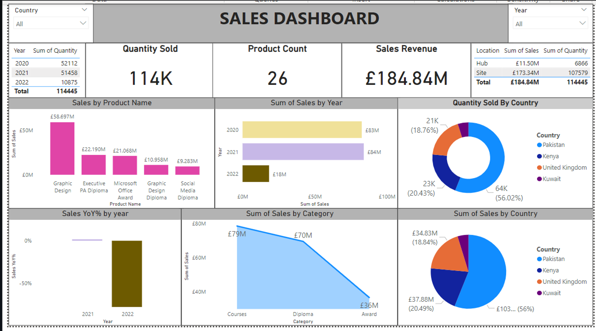

- # SALES PERFORMANCE DATA ANALYSIS PROJECT
---
A dynamic sales analytics dashboard designed to track multi‑year performance, highlight top‑selling products and regions, and empower strategic decision‑making through interactive, data‑driven insights.

---

*PROJECT OBJECTIVES:  
Deliver a clear overview of sales performance across years, products, and regions.
Identify top‑performing categories and uncover year‑over‑year sales trends.
Compare sales contribution across locations to support strategic resource decisions.
Enable data‑driven insights through interactive, drill‑down visual analytics.
Empower stakeholders to explore data dynamically and identify actionable opportunities.# 

---

## Dataset Used
The dataset used for this project is available in this repository.

[📂 Download Dataset](./Sales%20Data%20Part1.txt)

---
QUESTIONS (KPIS)
---
* How many products were sold overall, and what is the total sales revenue?

* Which products and categories generated the highest sales?

* How do sales and quantities vary across countries and years?

* What is the year‑over‑year (YoY) growth or decline in sales performance?

* Which location type (Hub vs Site) contributes most to total sales?

* Dashboard Interaction ## 📊 View Dashboard

  
PROCESS
---
* Data Preparation I Cleaned and standardized raw sales data (dates, countries, product names, categories, sales, and quantities) for consistency and accuracy.

* Data Modeling I Built relationships between tables and created DAX measures for KPIs such as Total Sales, Quantity Sold, and YoY Growth.

* Visualization Design I Designed an interactive Power BI dashboard using cards, bar charts, donut charts, and area charts to highlight key metrics and trends.

* Insight Generation I Identified top‑performing products, regional sales contributions, and year‑over‑year performance to support strategic decision‑making.

